Zadig DevOps 飞书项目插件允许在飞书项目触发 Zadig 工作流，自动化执行服务构建、部署、发布等操作，提升效率保障质量。

# **准备工作**

## Zadig 系统中新建项目插件配置账号

进入 Zadig 系统，新建一个插件管理员账号，新建后登录该账号并复制 Token 备用

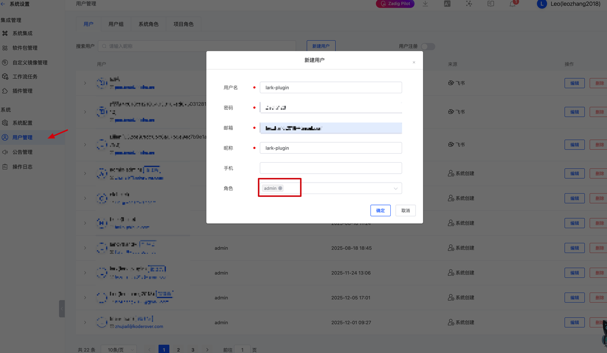

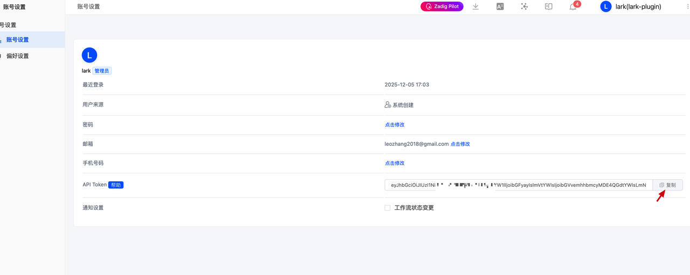

## **新建飞书项目插件并获取插件配置**

1.  访问 [飞书项目开放平台](https://project.feishu.cn/)

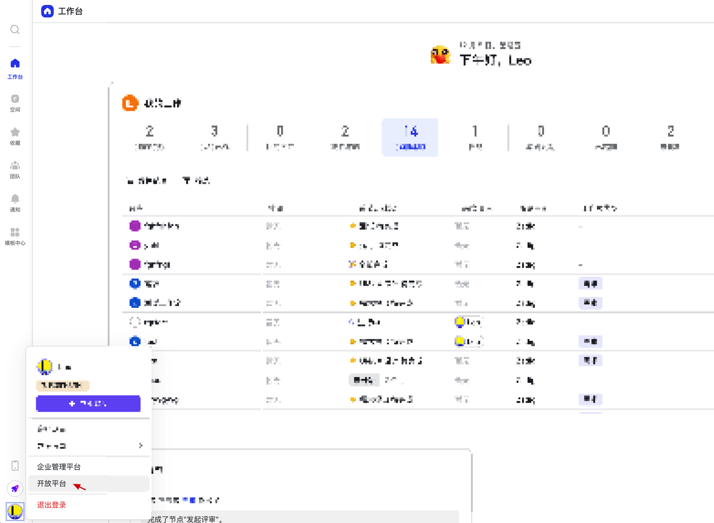

2.  选择「新建插件」，输入插件名称，新建插件

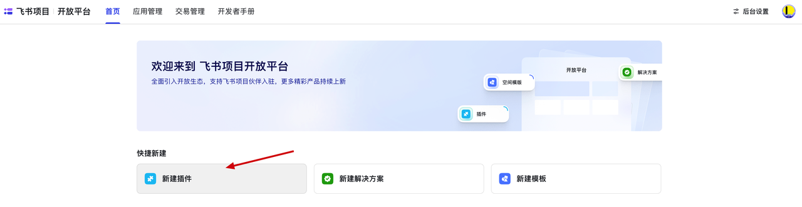
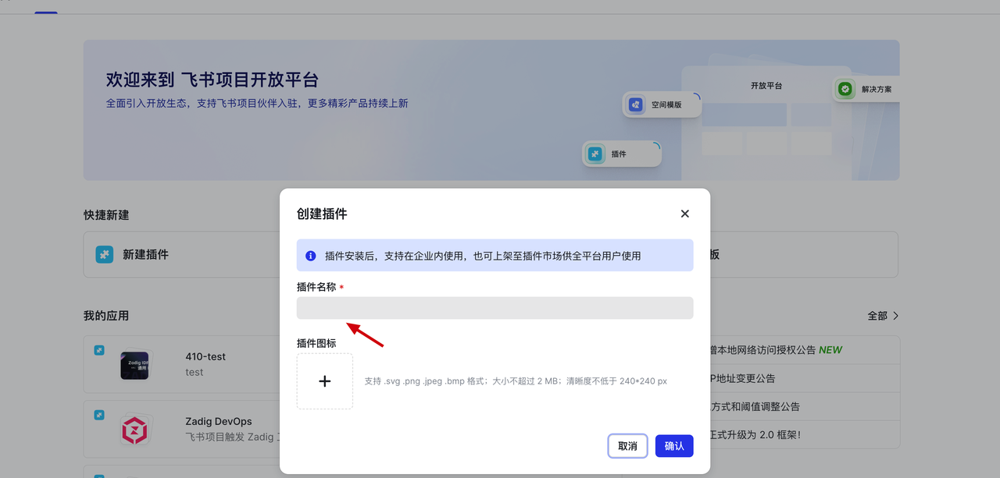

3.  进入插件详情，按照实际需求填写插件基本信息（插件名称、图标、插件描述、插件图标、插件分类、详情等），注意保存 Plugin ID、Plugin Secret

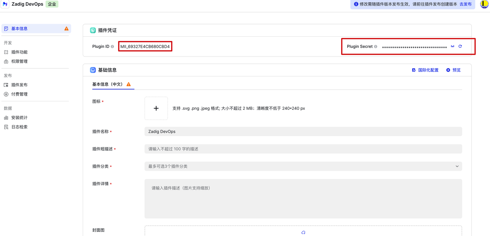

4.  选择「插件功能」，分别添加以下插件构成：

-   详情页：注意 resourceId 需要对应如图，即：zadig-dashboard
-   插件配置：注意 resourceId 需要对应如图，即：zadig-config


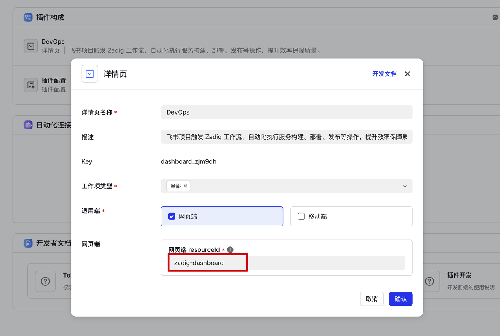
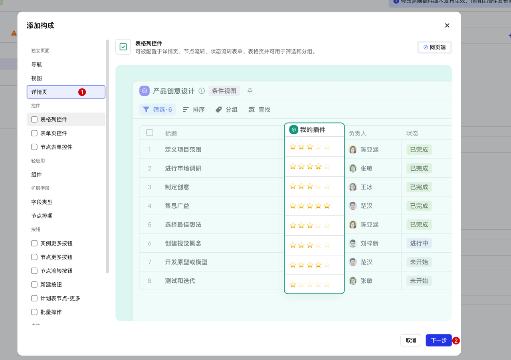
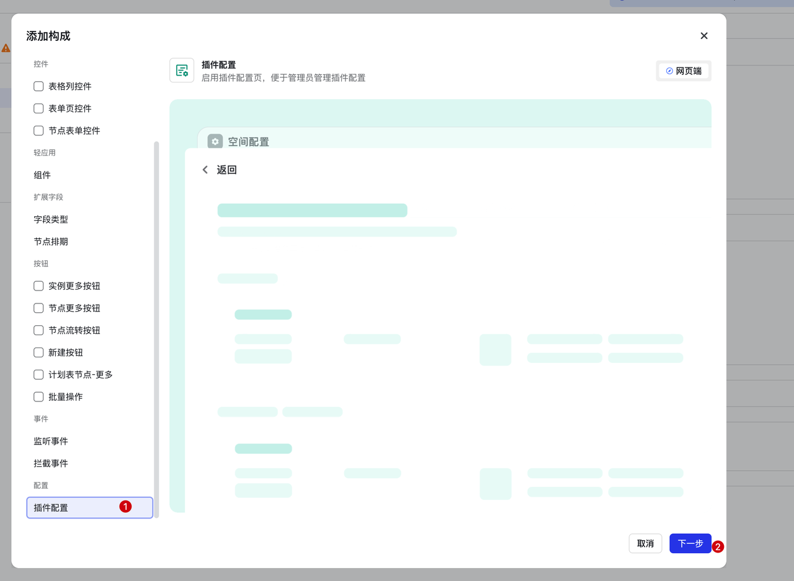
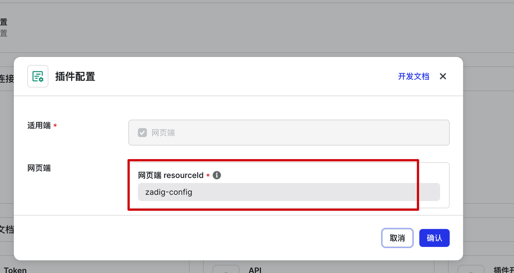

5.  选择「权限管理」，添加以下权限：

-   获取用户信息（跨空间）
-   获取空间信息（跨空间）
-   获取工作项实例信息
-   更新工作项实例数据
-   获取空间下的基础配置
-   获取空间下的高级配置

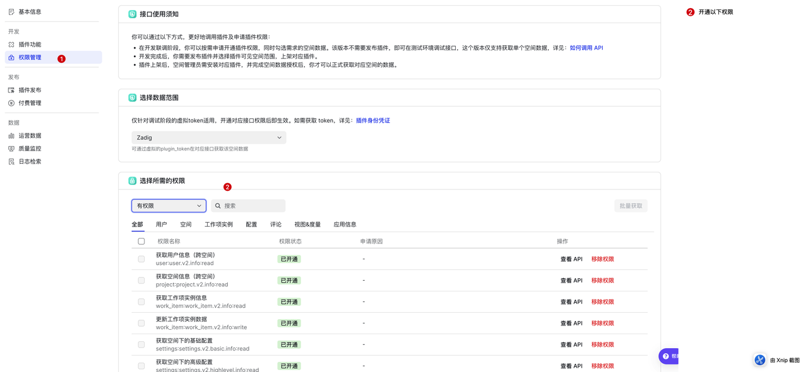

6.  选择基本信息页面获取 `Plugin ID` 和 `Plugin Secret`，复制后备用


## Zadig 后端配置更新

### 开启 HTTPS 和 CORS

Zadig 需要绑定域名并开启 HTTPS，并且针对`/api/plugin`的 path 需要开启跨于访问 CORS。

以下是 Ingress 的配置示例，其他网关请自行配置。

```yaml
# 除 /api/plugin 的 CORS 之外的正常 Ingress 配置
apiVersion: networking.k8s.io/v1
kind: Ingress
metadata:
  annotations:
    nginx.ingress.kubernetes.io/proxy-connect-timeout: "120"
    nginx.ingress.kubernetes.io/proxy-read-timeout: "3600"
    nginx.ingress.kubernetes.io/proxy-send-timeout: "3600"
    nginx.ingress.kubernetes.io/ssl-redirect: "false"
  name: zadig-ingress
spec:
  ingressClassName: koderover
  rules:
  - host: zadig-xxx.8slan.com
    http:
      paths:
      - backend:
          service:
            name: gateway-proxy
            port:
              number: 80
        path: /
        pathType: ImplementationSpecific
  tls:
  - secretName: zadig-xxxx-tls
```

```yaml
# /api/plugin CORS 的 Ingress 配置
apiVersion: networking.k8s.io/v1
kind: Ingress
metadata:
  annotations:
    nginx.ingress.kubernetes.io/cors-allow-credentials: "true"
    nginx.ingress.kubernetes.io/cors-allow-headers: Authorization,X-Plugin-Token,X-User-key,X-Workspace-Id,Content-Type,Accept,Origin,User-Agent
    nginx.ingress.kubernetes.io/cors-allow-methods: GET, POST, PUT, DELETE, OPTIONS
    nginx.ingress.kubernetes.io/cors-allow-origin: '*'
    nginx.ingress.kubernetes.io/cors-max-age: "3600"
    nginx.ingress.kubernetes.io/enable-cors: "true"
    nginx.ingress.kubernetes.io/proxy-connect-timeout: "120"
    nginx.ingress.kubernetes.io/proxy-read-timeout: "3600"
    nginx.ingress.kubernetes.io/proxy-send-timeout: "3600"
    nginx.ingress.kubernetes.io/ssl-redirect: "false"
  name: zadig-ingress-cors
spec:
  ingressClassName: koderover
  rules:
  - host: zadig-xxx.8slan.com
    http:
      paths:
      - backend:
          service:
            name: gateway-proxy
            port:
              number: 80
        path: /api/plugin
        pathType: ImplementationSpecific
  tls:
  - secretName: zadig-xxxx-tls
```


### 配置插件 ID 和 Secret

在 Zadig 的 Values 中添加以下配置，并重新部署 Zadig（同版本升级即可）：

```yaml
lark:
  plugin:
    id: MII_XXXXXXXXXXXXXX
    secret: XXXXXXXXXXXXXXXXXXXXXXXXXX
```

# 插件配置

克隆本项目后，根据飞书项目官方的 [开发客户端环境准备](https://project.feishu.cn/b/helpcenter/1p8d7djs/2ila4b2b#53942104) 部分进行环境配置。

切换到本项目的工作目录修改如下文件路径的文件配置，将准备工作中获取的配置进行替换：

plugin.config.json：

```json
{
  "siteDomain": "https://project.feishu.cn",
  "pluginId": "替换为你的插件 Plugin ID",
  "pluginSecret": "替换为你的插件 Plugin Secret",
  "resources": [
    {
      "id": "zadig-dashboard",
      "entry": "./src/features/dashboard/index.tsx"
    },
    {
      "id": "zadig-config",
      "entry": "./src/features/config/index.tsx"
    }
  ]
}

```

src/config/constants.ts：

```javascript

// Zadig 服务器地址
export const ZADIG_SERVER_URL = '替换为你的实际 Zadig 地址';

// 管理员认证配置
export const ADMIN_AUTH_CONFIG = {
  url: ZADIG_SERVER_URL,
  apiToken: '替换为你的插件管理员 Token'
};

```

# 插件发布

配置完成后可以运行 `lpm release` 命令进行插件发布，发布成功后，进入飞书项目插件开发平台，进入对应插件的插件发布，选择创建版本，按需填写基本信息以及使用范围，产物版本选择最新的版本，之后点击确定，即可完成企业内部上架流程。

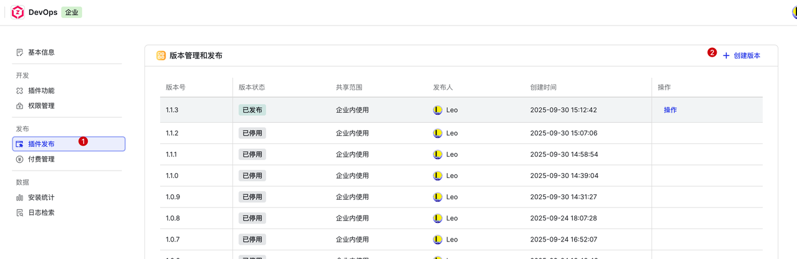

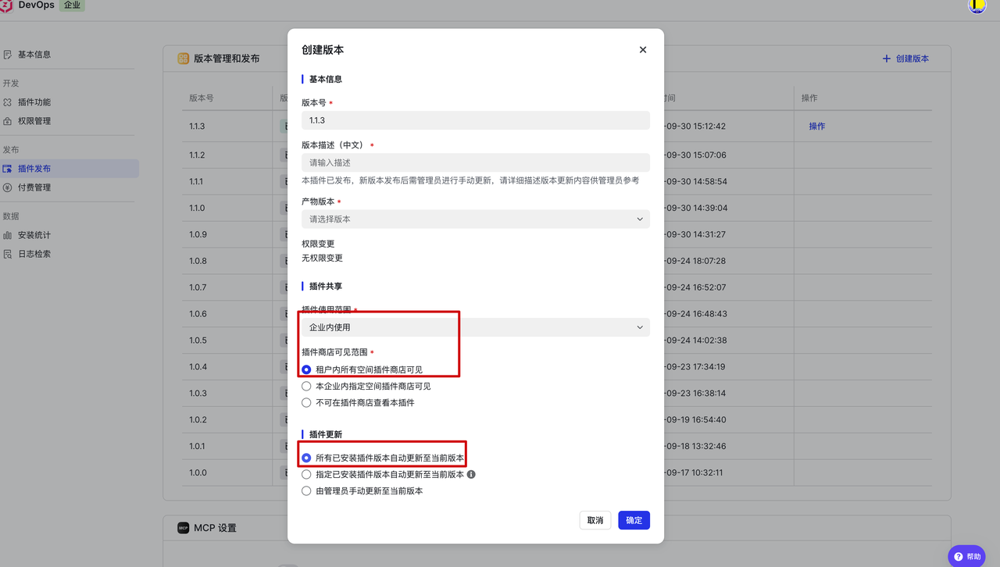

# 使用方式

参考：[飞书项目插件](https://docs.koderover.com/zadig/cn/Zadig%20v4.1/meego-plugin/#%E6%8F%92%E4%BB%B6%E9%85%8D%E7%BD%AE)